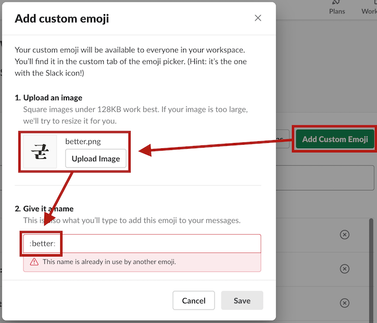
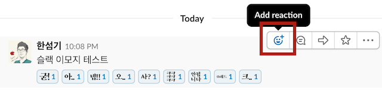
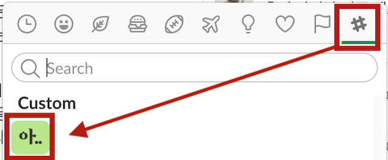
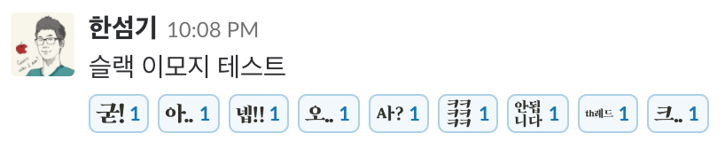

# 한글을 활용한 슬랙 이모지

## 라이선스
*  이 저작물은 <a rel="license" href="http://creativecommons.org/licenses/by-nc-nd/4.0/">크리에이티브 커먼즈 저작자표시-비영리-변경금지 4.0 국제 라이선스</a>에 따라 이용할 수 있습니다.
* 본 저작물에서 사용한 폰트는 [(주)피플펀드컴퍼니](https://www.peoplefund.co.kr/team/)의 명의로 구매한 [마켓히읗의 바람체](http://markethiut.com/product/detail.html?product_no=31)로, (주)피플펀드컴퍼니의 자산입니다.
* 슬랙 내에서는 저작자를 표시할 수 없으므로 자유롭게 사용하시면 됩니다.

## 사용 방법
* https://[WORKSPACE_NAME].slack.com/admin/emoji 에 접속합니다.

* **Add Custom Emoji**를 클릭하여 이모지 파일을 등록합니다.
  * 이모지 파일명을 적절하게 부여해두었으니 이모지 네임 설정 시 참고하시면 좋습니다.
  

* 슬랙에서 작성한 글에 마우스를 가져다대면 뜨는 **Add reaction** 버튼을 클릭합니다.
  

* 이모지 선택 팝업에서 **슬랙아이콘(#모양)** 을 클릭하면 직접 등록한 이모지를 선택할 수 있습니다.
  

* 상황에 맞게 적절히 사용합니다.

  

